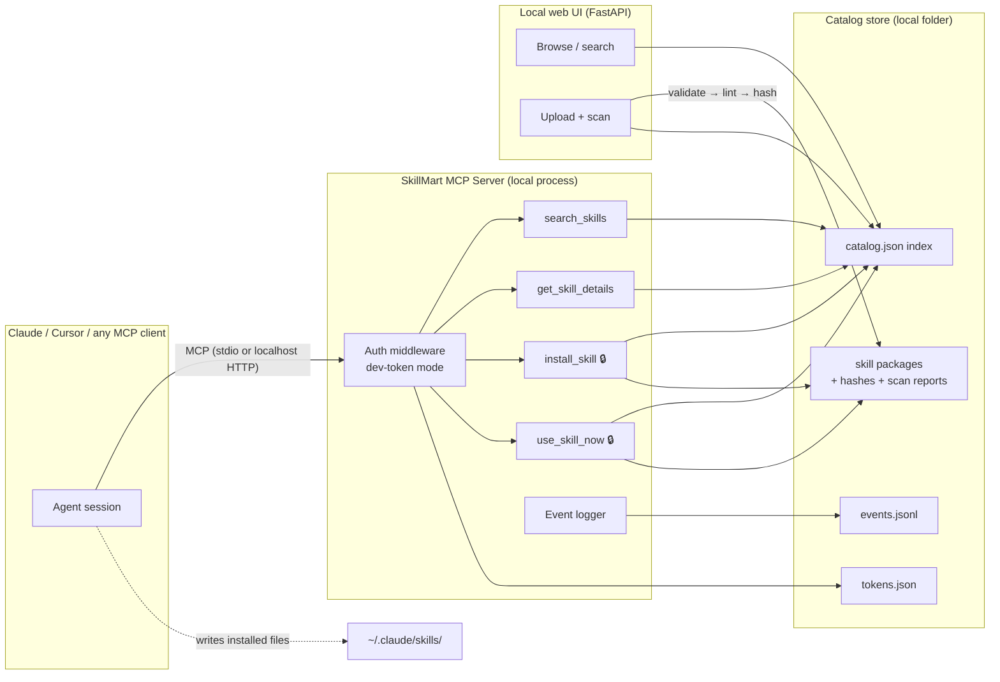

# Skill Marketplace — Phase 0 Architecture Design

**Working name:** SkillMart (placeholder)
**Scope:** Fully local MVP — one machine, one user, zero cloud dependencies
**Goal:** Prove the agent-native discovery → approve → install loop end-to-end, with the same enforcement chokepoints the production system will use

---

## 1. What Phase 0 must prove (and what it deliberately ignores)

| Proves | Defers |
|---|---|
| Agent discovers skills mid-task via MCP and suggests them | Real OAuth 2.1 (stubbed with local tokens) |
| Install completes in < 30 seconds with user approval | Payments, pricing, entitlement tiers |
| Server-side gating works (no token → no install) | Remote hosting / multi-user |
| Ingest pipeline: validate → scan → hash → publish | Eval/certification pipeline |
| Streaming delivery fallback (skill into context, no disk) | IP licensing enforcement, watermarking |
| Demand telemetry (what users search and don't find) | Ranking, reviews, discovery algorithms |

The architecture rule for every Phase 0 decision: **local now, remote later, with no rewrite** — every component that becomes a cloud service in Phase 1 is built behind an interface where "local" is just one configuration.

---

## 2. System overview



Three processes maximum: the MCP server, the local website, and (optionally) a CLI for ingest. All share one source of truth: the catalog folder.

---

## 3. Components

### 3.1 MCP Server

**Stack:** Python 3.11+, official `mcp` SDK (FastMCP style). ~400 lines.

**Transport:** dual-mode via flag:
- `--stdio` (default for Phase 0) — connect with `claude mcp add skillmart -- python -m skillmart.server`. Zero network setup.
- `--http --port 8321` — Streamable HTTP on localhost. Same code path production will use; lets you test the exact deployment mode early.

**Tools exposed:**

| Tool | Auth | Input | Returns |
|---|---|---|---|
| `search_skills` | none | `query`, optional `tags`, `limit` | Ranked matches: id, name, one-liner, version, scan status, price (always 0 in P0) |
| `get_skill_details` | none | `skill_id` | Full metadata, long description, scan report, sha256, license, file listing |
| `install_skill` | **token** | `skill_id` | File map `{relative_path: content}` + install instructions for the agent + post-install note |
| `use_skill_now` | **token** | `skill_id` | The SKILL.md body returned directly as tool result (streaming mode — no disk write) |
| `list_entitlements` | token | — | Skills this token has installed/loaded, from server-side records |
| `report_gap` | none | `description` | Logs "I needed a skill that doesn't exist" — the demand-signal goldmine |

**The most important 20 lines in the codebase are not code — they're the tool descriptions.** `search_skills` must be described so the agent reaches for it when it *lacks a capability*, not only when the user says "search the store." Draft:

> *"Search the skill marketplace. Use this whenever the user asks for something you don't have a specific skill for — a document type, workflow, integration, or domain expertise — before attempting it unaided. Also use when the user explicitly asks to find or browse skills."*

Phase 0's primary experiment is tuning this description until mid-task triggering is reliable.

**Search implementation:** keyword match over name/description/tags with simple scoring (BM25-ish or even weighted substring). No embeddings in P0 — catalog is 20 items. The interface (`query in → ranked ids out`) stays stable when you swap in real search later.

### 3.2 Auth (stubbed, but structurally real)

- `AUTH_MODE=dev`: tokens live in `data/tokens.json` — `{token: {user_id, created_at, entitlements: []}}`. A CLI command mints one: `skillmart token create xin`.
- The client passes the token via env var in the MCP server config (stdio mode) or `Authorization` header (HTTP mode).
- **Gating happens in one middleware function** — the single place that later swaps to OAuth 2.1 token validation. Search/details pass through anonymously; install/use/list require a valid token; invalid or missing token returns a structured error whose message tells the agent how the user can register ("run `skillmart token create` / visit the site"). The agent relays that gracefully — this is the registration-flow UX in miniature.
- Every authed call is attributed to `user_id` in the event log — the seed of entitlement records, metering, and telemetry.

Why bother stubbing instead of skipping: the *chokepoint placement* is the thing being validated. If the P0 funnel feels wrong (users bounce at install-gate), you learn it now, before OAuth work.

### 3.3 Catalog store

```
marketplace/
├── catalog/
│   ├── catalog.json                  # the index — single source of truth
│   └── skills/
│       └── <skill-id>/
│           └── <version>/
│               ├── SKILL.md          # required
│               ├── scripts/          # optional
│               ├── references/       # optional
│               └── _meta/
│                   ├── scan.json     # security lint report
│                   └── package.sha256
├── data/
│   ├── events.jsonl                  # append-only telemetry
│   └── tokens.json
├── server/                           # MCP server package
└── site/                             # local web UI
```

**catalog.json entry schema:**

```json
{
  "id": "invoice-generator",
  "name": "Invoice Generator",
  "one_liner": "Generate professional PDF invoices from plain-text order details",
  "description": "…full markdown…",
  "version": "1.2.0",
  "author": {"id": "creator-01", "name": "Jane Doe", "verified": false},
  "license": "SkillMart-Open-v0",
  "tags": ["finance", "pdf", "documents"],
  "price_usd": 0,
  "sha256": "…hash of canonical zip…",
  "scan": {"status": "pass", "points_checked": 8, "findings": [], "scanned_at": "…"},
  "capabilities": {"network": false, "shell": false, "file_write": true},
  "created_at": "…",
  "updated_at": "…",
  "stats": {"installs": 0, "loads": 0}
}
```

The `capabilities` block is the embryo of the declared-capabilities manifest from the full design — in P0 it's *derived by the lint*, not enforced, but it already displays on listings and in pre-install summaries.

**Versioning & hashing:** every version is immutable once published; the sha256 is computed over a canonical zip (sorted paths, stripped timestamps). New upload of same id = new version directory. This is the provenance/transparency-log seed: append `{id, version, sha256, timestamp}` to a `publish_log.jsonl` that never gets edited.

### 3.4 Ingest pipeline (upload path)

One function used by both the web upload form and a CLI (`skillmart publish ./my-skill/`):

1. **Validate structure** — SKILL.md exists, frontmatter has `name` + `description`, description length sane, no files > 5 MB, total < 20 MB.
2. **Security lint (8 checks)** — see §5.
3. **Derive capabilities** — from lint findings (does any script make network calls? invoke shell? write files?).
4. **Hash** — canonical zip → sha256.
5. **Write** — package dir + scan.json + catalog.json entry + publish_log line.
6. **Reject path** — lint failures return a human-readable report; hard-fail checks (secrets present, obfuscated blobs) block publish, soft warnings publish with flags visible on the listing.

### 3.5 Local web UI

**Stack:** FastAPI + Jinja templates (or a single-file HTMX page). ~250 lines. Serves at `localhost:8322`.

Pages: catalog browse/search (reads catalog.json), skill detail (description, scan report, capabilities, hash, version history), upload form (calls the ingest pipeline, shows the scan report as the confirmation screen). No accounts, no styling beyond readable. Its job is to be the creator-side mirror of the MCP buyer-side — and to be demo-able.

### 3.6 Telemetry

`events.jsonl`, append-only, one JSON object per line: `{ts, event, user_id|anon, payload}` for `search`, `search_no_results`, `details_view`, `install`, `load`, `gap_report`, `install_confirmed`. Even in single-user P0 this matters: it builds the habit and the schema, and by Phase 1 (testers) it becomes your demand-discovery engine — *searches with no results are literally a purchase-intent list for skills that don't exist yet.*

---

## 4. Key flows

### 4.1 Mid-task discovery → install (the money flow)

```
User: "Turn this order list into a proper invoice PDF"
  → Agent lacks a specific skill; sees search_skills description; calls search_skills("invoice pdf generation")
  → Server returns: invoice-generator v1.2.0, scan: pass, no network access, free
  → Agent to user: "There's a certified skill for this — Invoice Generator (security-scanned,
     no network access). Install it?"                                    [APPROVAL GATE]
  → User: yes
  → Agent calls install_skill("invoice-generator") with token
  → Server: validates token → logs install → returns file map + instructions
  → Agent writes files to ~/.claude/skills/invoice-generator/ ; confirms
  → Agent proceeds with the task (this session or next, per client's skill-reload behavior)
```

Design notes: the approval gate is non-negotiable (trust + safety); the pre-install summary shows scan status and capabilities — the trust layer earning its keep; if no token, the server's error walks the user through registration *inside the conversation*.

### 4.2 Streaming fallback (`use_skill_now`)

Same up to approval, then the agent calls `use_skill_now` and the SKILL.md body arrives as the tool result — in context, nothing on disk. Serves platforms without local file tools, and doubles as instant "try it this session before installing." This one tool is the Phase-3 metered-delivery architecture already alive in embryo — in production it's where per-call metering, trials, and canary fingerprints attach.

### 4.3 Upload

Creator zips folder (or points CLI at it) → ingest pipeline → scan report shown → published to catalog → immediately discoverable via MCP. Round-trip demo: upload a skill in the browser, then ask Claude for that capability and watch it get found, suggested, and installed.

---

## 5. Security lint — the 8 checks (P0 version)

Static checks, regex/AST level, cheap and imperfect on purpose (production adds sandboxed dynamic testing):

1. **Dangerous shell patterns** — `rm -rf`, `curl … | bash`, `chmod +x` on downloaded content, sudo.
2. **Network access** — `requests`, `urllib`, `fetch`, `curl`, `wget` in scripts; flags → `capabilities.network`.
3. **Secret/credential harvesting** — reads of `~/.aws`, `~/.ssh`, `.env`, keychain paths, `os.environ` sweeps.
4. **Hardcoded secrets** — API-key/token patterns in any file (hard fail).
5. **Obfuscation** — base64 blobs > 200 chars, `exec()`/`eval()` on strings, hex-packed payloads (hard fail).
6. **Prompt injection** — "ignore previous instructions," attempts to redefine the agent's identity or exfiltrate conversation content into URLs.
7. **Filesystem escape** — path traversal (`../`), absolute paths outside the skill's own directory, writes to shell rc files.
8. **Executable payloads** — binaries, `.so`/`.dll`, pickled objects present in package (hard fail).

Output: `scan.json` with per-check pass/warn/fail + evidence lines. Warn-level findings publish but display; fail-level block. This already matches Agensi's claimed depth — and it's on a listing page next to a capabilities manifest, which they don't show.

---

## 6. Enforcement model — what is actually enforced where (P0)

| Guarantee | Enforced by | Real or stubbed? |
|---|---|---|
| No install without identity | Server middleware | Real mechanism, dev tokens |
| User approves before install | Agent behavior + tool description contract | Convention (client-side) |
| Published skill = scanned skill | Ingest pipeline (only path into catalog) | Real |
| Version immutability / provenance | Append-only publish log + hashes | Real |
| Skill can't exceed declared capabilities | — | **Not enforced** (displayed only; runtime enforcement is the host platform's, not ours) |

Being honest about the last row now prevents overclaiming later: your production trust story is *certification + transparency*, not runtime sandboxing you don't control.

---

## 7. Success metrics for Phase 0

1. **Mid-task trigger rate ≥ 50%** — across 10 scripted scenarios where a relevant skill exists in the catalog, the agent spontaneously searches and suggests in at least 5, without the user mentioning skills or the marketplace.
2. **Install round-trip < 30 s** from user approval to files on disk, ≥ 95% success.
3. **Gating works** — with no/invalid token, install fails with a recoverable, in-conversation registration prompt; with token, succeeds.
4. **Upload round-trip < 2 min** — folder → scanned → published → discoverable via a fresh MCP search.
5. **Telemetry captures every search and install**, including no-result searches.

If metric 1 fails after serious description-tuning, that's a pivot signal toward heavier reliance on explicit invocation ("check the skill store") and the web UI — better to learn for free in P0 than after building payments.

---

## 8. Build plan

| # | Work item | Est. |
|---|---|---|
| 1 | Repo scaffold, catalog schema, 15–20 seeded skills (curated open-source) | 0.5 d |
| 2 | MCP server: tools, search, dual transport | 1 d |
| 3 | Auth middleware + token CLI + event logger | 0.5 d |
| 4 | Ingest pipeline + 8-point lint | 1 d |
| 5 | Local web UI (browse/detail/upload) | 1 d |
| 6 | Install-flow polish: descriptions tuning, approval UX, error paths | 1 d |
| 7 | Scripted scenario tests + metrics run | 0.5 d |

**~5.5 focused days hand-built; substantially less with me writing it.** Python throughout, no database, no docker required (plain `pip install -e . && skillmart serve`).

---

## 9. Roadmap context (where P0 sits)

- **Phase 0 (this doc):** local MVP — mechanics + chokepoints proven on one machine.
- **Phase 1:** deploy the same server (HTTP mode) to a $5 VPS/fly.io; real OAuth 2.1; catalog hosted; 5–10 external testers; telemetry becomes real demand data. *No new components — configuration and hardening.*
- **Phase 2:** payments — Stripe checkout linked from the registration flow; entitlements list on the token becomes real; first paid skills; trial counters on `use_skill_now`.
- **Phase 3:** the differentiators — eval/certification pipeline, published scores and ranking, transparency log made public, canary fingerprinting on delivery, creator dashboard, bounty board.

---

## 10. Open decisions (need your call before build)

1. **Working name** — "SkillMart" is a placeholder; the MCP server name shows up in every client config, so pick early.
2. **Python vs TypeScript** for the server — Python recommended (faster to write, fine for P0/P1 scale); TS only if you expect to hire JS-first.
3. **Seed catalog composition** — which 15–20 skills? Recommendation: pull from high-quality open-source skill repos (Anthropic's own published skills, community favorites) + 2–3 written by you in a domain you know, so at least a few are demo-impressive.
4. **stdio-first or HTTP-first** for your own daily use — recommendation: stdio for day one simplicity, but run the HTTP mode weekly so deployment never drifts.
